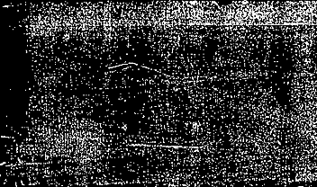

<div align="center">



# 🌊 DARK SEA
### Audio-Based Survival Horror Game

[](https://unity.com/)
[](https://darksea-fyp.itch.io/dark-sea)
[](https://docs.microsoft.com/en-us/dotnet/csharp/)
[](#)
[](#)

**A psychological horror survival game designed for both sighted and visually impaired players.**  
*Navigate the darkness. Trust only sound.*

[🎮 Play Now on itch.io](https://darksea-fyp.itch.io/dark-sea) · [📖 Documentation](#) · [🐛 Report Bug](https://github.com/AliHadi-11/DarkSea-Prototype/issues)

</div>

---

## 📌 Table of Contents

- [About the Project](#-about-the-project)
- [Problem Statement](#-problem-statement)
- [Features](#-features)
- [Gameplay](#-gameplay)
- [Controls](#-controls)
- [Level Design](#-level-design)
- [Tech Stack](#-tech-stack)
- [Project Structure](#-project-structure)
- [How to Run Locally](#-how-to-run-locally)
---

## 🎯 About the Project

**Dark Sea** is a 3D first-person survival horror game set in a deep underwater environment. Unlike traditional horror games that rely on visual scares, Dark Sea uses **3D spatial audio**, **sonar-based navigation**, and **AI-driven enemies** to create an immersive experience that is equally accessible to both sighted and visually impaired players.

The game was developed as a **Final Year Project** at the **University of Lahore** (BSCS 2022–2026).

> *"We believe accessibility in gaming is not a feature — it's a right."*

---

## ❗ Problem Statement

Most horror games depend on dark visuals and jump scares, creating a barrier for the **285 million visually impaired people** worldwide (WHO data). There is a significant lack of desktop-grade survival horror games that are accessible without sight.

**Dark Sea bridges this gap** by replacing visual feedback with:
- 🔊 3D Spatial Audio (directional sound)
- 📡 Sonar Echolocation System
- 🎮 Haptic Feedback (vibration alerts)
- 🤖 Voice-Mimicking AI Enemies

---

## ✨ Features

| Feature | Description |
|---|---|
| 📡 **Sonar Navigation** | Press SPACEBAR to emit sound waves — detect walls and enemies by echo |
| 🧠 **Mimic AI** | Level 3 enemies copy human voices to lure and confuse players |
| 🫧 **Oxygen System** | Real-time oxygen depletion — find tanks or suffocate |
| 🗺️ **Minimap HUD** | Circular radar showing player position and enemy blips |
| 👁️ **Accessible Design** | Fully playable without sight using audio cues only |
| 🎚️ **Difficulty System** | Easy / Normal / Hard — adjusts oxygen drain and enemy speed |
| 🏆 **Score System** | Points based on oxygen remaining, time, and tanks collected |
| 🔐 **Auth System** | Register & Login with local profile save |
| 📊 **Advanced HUD** | Procedural sonar radar drawn with Painter2D |

---

## 🎮 Gameplay

The player is a deep-sea diver stranded in a pitch-black underwater maze. Without visual aids, survival depends entirely on **sound and spatial awareness**.

```
Start → Register/Login → Main Menu → Level 1 → Level 2 → Level 3 → Victory
```

### How it Works
1. **Press SPACEBAR** → Sonar ping emits sound waves
2. **Listen to echo** → Detect walls and enemy distance
3. **Check radar** → Minimap shows enemy positions as red blips
4. **Manage oxygen** → Collect glowing tanks to stay alive
5. **Reach the exit** → Beat each level to unlock the next

---

## 🕹️ Controls

| Key | Action |
|---|---|
| `W` / `S` | Move Forward / Backward |
| `A` / `D` | Turn Left / Right |
| `Mouse` | Look Around |
| `SPACEBAR` | **Sonar Ping** + Kill enemy (within 3.5m) |
| `V` | Toggle 1st / 3rd Person Camera |
| `ESC` | Pause Menu |

---

## 🗺️ Level Design

### Level 1 — The Crash 🔴
> *Difficulty: Normal*

- Chase enemy pursues the player
- Learn sonar navigation basics
- Find and reach the **Exit Gate**

### Level 2 — The Trench 🟡
> *Difficulty: Medium*

- Passive patrol enemy (doesn't attack)
- Collect **3 hidden oxygen tanks** to unlock exit
- Resource management challenge

### Level 3 — The Nest 🔴🔴
> *Difficulty: Hard*

- **Hunt enemy** — faster speed, aggressive AI
- **Mimic AI** — copies human voices to deceive you
- Do NOT trust what you hear

---

## 🛠️ Tech Stack

| Technology | Purpose |
|---|---|
| **Unity 6 (6000.4.6f1)** | Game Engine |
| **C#** | Programming Language |
| **NavMesh Agent** | AI Enemy Pathfinding |
| **UI Toolkit (UIDocument)** | HUD, Minimap, Menus |
| **Painter2D** | Procedural Sonar Radar |
| **Unity Physics (Raycast)** | Sonar Detection System |
| **PlayerPrefs** | Local Auth & Save System |
| **WebGL** | Browser Deployment |

---

## 📁 Project Structure

```
DarkSea_Prototype/
├── Assets/
│   ├── GameScripts/          # All C# gameplay scripts
│   │   ├── PlayerMovementFinal.cs
│   │   ├── EnemyAI_Final.cs
│   │   ├── OxygenSystem.cs
│   │   ├── SonarSystem.cs
│   │   ├── MinimapHUD.cs
│   │   ├── AdvancedHUD.cs
│   │   └── LevelExit.cs
│   ├── Scenes/               # 10 Unity scenes
│   │   ├── RegisterScene
│   │   ├── LoginScene
│   │   ├── MainMenu
│   │   ├── DarkSea (Level 1)
│   │   ├── Level_2
│   │   └── Level_3
│   ├── Resources/Audio/      # Sound effects & ambience
│   ├── Settings/             # URP render pipeline assets
│   └── Editor/               # Build scripts
├── ProjectSettings/
└── README.md
```

---

## 🚀 How to Run Locally

### Option 1 — Play in Browser (Recommended)
👉 **[https://darksea-fyp.itch.io/dark-sea](https://darksea-fyp.itch.io/dark-sea)**  
No installation needed. Click "Run game" and play instantly.

### Option 2 — Run in Unity Editor
```bash
# Prerequisites: Unity 6 (6000.4.6f1) with WebGL Build Support

git clone https://github.com/AliHadi-11/DarkSea-Prototype.git
```
1. Open **Unity Hub**
2. Click **"Add project from disk"**
3. Select the cloned folder
4. Open the project
5. Load `Assets/Scenes/RegisterScene.unity`
6. Press **Play**

---

## 📄 License

This project was developed as an academic Final Year Project at the University of Lahore. All rights reserved © 2026.

---

<div align="center">

**⭐ Star this repo if you found it helpful!**

Made with ❤️ at University of Lahore

</div>
